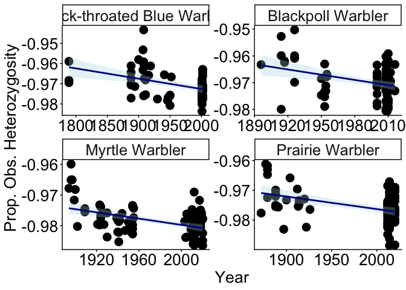

Calculate Diversity Statistics
================
Ore, MJ.
2025-09-19

## Create file for each species

``` r
library(tidyverse)

# 
meta <- read.csv(here("data/warbler_341_final_metadata.csv"))

## for each species/sampling category 
sp <- unique(meta$Species_samplingcategory)
output_dir <- "data/"


for (i in 1:length(sp)){
  splist <- meta$SpecimenID[meta$Species_samplingcategory == sp[i]]
  spname <- sp[i]
  write.table(splist, file = paste0(output_dir, "SpecimenID_", spname, ".txt"),
              quote = F, row.names = F, col.names = F)
} 

## for all individual (historic and contemporary) per species 
sp <- unique(meta$Sp)
# ##for variant sites
output_dir <- "data/"


for (i in 1:length(sp)){
  splist <- meta$SpecimenID[meta$Sp == sp[i]]
  spname <- sp[i]
  write.table(splist, file = paste0(output_dir, "SpecimenID_", spname, ".txt"),
              quote = F, row.names = F, col.names = F)
}
```

\#separate vcfs

``` bash

# Making per sp/time vcfs for all sites
vcftools --vcf warbler_341_all_sites_highcov.recode.vcf --keep SpecimenID_BLPW_historic.txt --recode --out BLPW_historic_341_all_sites_highcov
vcftools --vcf warbler_341_all_sites_highcov.recode.vcf --keep SpecimenID_BTBW_historic.txt --recode --out BTBW_historic_341_all_sites_highcov
vcftools --vcf warbler_341_all_sites_highcov.recode.vcf --keep SpecimenID_PRAW_historic.txt --recode --out PRAW_historic_341_all_sites_highcov
vcftools --vcf warbler_341_all_sites_highcov.recode.vcf --keep SpecimenID_YRWA_historic.txt --recode --out YRWA_historic_341_all_sites_highcov

vcftools --vcf warbler_341_all_sites_highcov.recode.vcf --keep SpecimenID_BLPW_contemporary.txt --recode --out BLPW_contemporary_341_all_sites_highcov
vcftools --vcf warbler_341_all_sites_highcov.recode.vcf --keep SpecimenID_BTBW_contemporary.txt --recode --out BTBW_contemporary_341_all_sites_highcov
vcftools --vcf warbler_341_all_sites_highcov.recode.vcf --keep SpecimenID_PRAW_contemporary.txt --recode --out PRAW_contemporary_341_all_sites_highcov
vcftools --vcf warbler_341_all_sites_highcov.recode.vcf --keep SpecimenID_YRWA_contemporary.txt --recode --out YRWA_contemporary_341_all_sites_highcov


# Making per sp vcfs for variant sites
vcftools --vcf warbler_341_unlinked_variants_highcov.recode.vcf --keep SpecimenID_BLPW.txt --recode --out BLPW_341_unlinked_variants_highcov
vcftools --vcf warbler_341_unlinked_variants_highcov.recode.vcf --keep SpecimenID_BTBW.txt --recode --out BTBW_341_unlinked_variants_highcov
vcftools --vcf warbler_341_unlinked_variants_highcov.recode.vcf --keep SpecimenID_YRWA.txt --recode --out YRWA_341_unlinked_variants_highcov
vcftools --vcf warbler_341_unlinked_variants_highcov.recode.vcf --keep SpecimenID_PRAW.txt --recode --out PRAW_341_unlinked_variants_highcov
```

``` bash

## heterozygosity
vcftools --vcf warbler_biodiv/warbler_341_all_sites_highcov.recode.vcf.gz --het --out warbler_341_all_sites_variants_highcov
```

## Pixy calculation of Pi

``` bash

## run in terminal - pixy runs in bash not R
## moved warbler_364_final.recode.vcf and INDVspecies into workdir

conda create --name pixy
conda activate pixy

conda install --yes -c conda-forge pixy
conda install --yes -c bioconda htslib
conda install -c bioconda samtools=1.9 --force-reinstall -y

################ ALL Individuals ########################
### make population file
# get list of individuals in vcf
bcftools query -l warbler_341_all_sites_highcov.recode.vcf > INDV

###make sp/time file from metadata
R
library(tidyverse)

meta <- read.csv("warbler_341_final_metadata.csv") %>% 
select(SpecimenID, Species_samplingcategory)

write_tsv(meta, "warbler_341_IDpop.tsv", quote = "none", col_names = F)

quit()
###

#check that txt file is tab-separated - if you get error: Checking sample data...pandas.errors.ParserError: Too many columns specified: expected 2 and found 1
head -n 10 warbler_341_IDpop.tsv | grep -P "\t"
# and fix - if space-sep
# tr ' ' '\t' < warbler_341_IDpop.tsv > warbler_341_IDpop.tsv

# compress and index vcf
bgzip warbler_341_all_sites_highcov.recode.vcf
tabix warbler_341_all_sites_highcov.recode.vcf.gz

##run pixy
pixy --stats pi --vcf warbler_341_all_sites_highcov.recode.vcf.gz --populations warbler_341_IDpop.tsv --n_cores 4 --window_size 1 --output_prefix warbler_341_all_sites_highcov_window1 >& pixy.log 
```

# test for significance

``` r
# downsample to even samplesizes and bootstrap function 
bootstrap_with_ttest <- function(df, metric, 
                                group_column = "SamplingCategory",
                                baseline_group = "historic",
                                comparison_group = "contemporary",
                                n_bootstrap = 1000) {
  
  # Extract data for each group
  baseline_data <- df[df[[group_column]] == baseline_group, metric]
  comparison_data <- df[df[[group_column]] == comparison_group, metric]
  
  # Remove NA values
  baseline_data <- baseline_data[!is.na(baseline_data)]
  comparison_data <- comparison_data[!is.na(comparison_data)]
  
  # Find minimum sample size for equal sampling
  min_n <- min(length(baseline_data), length(comparison_data))
  
  cat("Baseline group (", baseline_group, "): n =", length(baseline_data), "\n")
  cat("Comparison group (", comparison_group, "): n =", length(comparison_data), "\n")
  cat("Downsampling to n =", min_n, "per group\n\n")
  
  # Bootstrap resampling
  set.seed(123)
  bootstrap_results <- replicate(n_bootstrap, {
    # Sample equal sizes from each group
    baseline_sample <- sample(baseline_data, min_n, replace = FALSE)
    comparison_sample <- sample(comparison_data, min_n, replace = FALSE)
    
    # Calculate means and percentage change
    baseline_mean <- mean(baseline_sample)
    comparison_mean <- mean(comparison_sample)
    percent_change <- ((comparison_mean - baseline_mean) / baseline_mean) * 100
    
    # Perform t-test on this bootstrap sample
    t_result <- t.test(comparison_sample, baseline_sample)
    
    return(c(
      percent_change = percent_change,
      p_value = t_result$p.value,
      baseline_mean = baseline_mean,
      comparison_mean = comparison_mean
    ))
  })
  
  # Extract results
  percent_changes <- bootstrap_results[1, ]
  p_values <- bootstrap_results[2, ]
  baseline_means <- bootstrap_results[3, ]
  comparison_means <- bootstrap_results[4, ]
  
  # Calculate statistics
  mean_percent_change <- mean(percent_changes)
  percent_ci <- quantile(percent_changes, c(0.025, 0.975))
  
  # Overall p-value (median of bootstrap p-values)
  median_p_value <- median(p_values)
  
  # Proportion of significant bootstrap tests
  prop_significant <- mean(p_values < 0.05)
  
  return(list(
    baseline_group = baseline_group,
    comparison_group = comparison_group,
    sample_sizes = c(length(baseline_data), length(comparison_data)),
    downsampled_n = min_n,
    
    # Percentage change results
    mean_percent_change = mean_percent_change,
    percent_ci_lower = percent_ci[1],
    percent_ci_upper = percent_ci[2],
    
    # T-test results
    median_p_value = median_p_value,
    prop_significant = prop_significant,
    
    # Group means
    baseline_mean = mean(baseline_means),
    comparison_mean = mean(comparison_means),
    
    # Bootstrap distributions
    bootstrap_percent_changes = percent_changes,
    bootstrap_p_values = p_values
  ))
}
```

Pi

``` r
pixy <- read.table("data/warbler_341_all_sites_highcov_window1_pi.txt", header = T)

## statistical test
#prep df for bootstrap testing
pixy_pop <- pixy %>% 
  separate(pop, into = c("Species", "SamplingCategory"), sep = "_")


blpw <- pixy_pop[pixy_pop$Species == "BLPW",]
blpw_pi_results <- bootstrap_with_ttest(blpw, metric = "avg_pi")
```

    ## Baseline group ( historic ): n = 10833 
    ## Comparison group ( contemporary ): n = 10833 
    ## Downsampling to n = 10833 per group

``` r
btbw <- pixy_pop[pixy_pop$Species == "BTBW",]
btbw_pi_results <- bootstrap_with_ttest(btbw, metric = "avg_pi")
```

    ## Baseline group ( historic ): n = 10833 
    ## Comparison group ( contemporary ): n = 10833 
    ## Downsampling to n = 10833 per group

``` r
praw <- pixy_pop[pixy_pop$Species == "PRAW",]
praw_pi_results <- bootstrap_with_ttest(praw, metric = "avg_pi")
```

    ## Baseline group ( historic ): n = 10833 
    ## Comparison group ( contemporary ): n = 10833 
    ## Downsampling to n = 10833 per group

``` r
yrwa <- pixy_pop[pixy_pop$Species == "YRWA",]
yrwa_pi_results <- bootstrap_with_ttest(yrwa, metric = "avg_pi")
```

    ## Baseline group ( historic ): n = 10833 
    ## Comparison group ( contemporary ): n = 10833 
    ## Downsampling to n = 10833 per group

``` r
sp <- c("blpw", "btbw", "praw", "yrwa")
species_names <- c("Blackpoll Warbler", "Black-throated Blue Warbler", 
                   "Prairie Warbler", "Yellow-rumped Warbler")

pixy_results <- data.frame()

for (i in 1:length(sp)){
  # Get the results objects dynamically
  pi_results <- get(paste0(sp[i], "_pi_results"))

  # Create row for this species
  sp_results <- data.frame(
    Species = species_names[i],
    Species_code = sp[i],
    pi_mean_percent_change = pi_results$mean_percent_change, 
    pi_CI_lower = pi_results$percent_ci_lower, 
    pi_CI_upper = pi_results$percent_ci_upper, 
    pi_p = pi_results$median_p_value
  )
  
  # Add to results table
  pixy_results <- rbind(pixy_results, sp_results)
}

pixy_results
```

    ##                           Species Species_code pi_mean_percent_change
    ## 2.5%            Blackpoll Warbler         blpw              -9.426542
    ## 2.5%1 Black-throated Blue Warbler         btbw             -14.781172
    ## 2.5%2             Prairie Warbler         praw             -13.785946
    ## 2.5%3       Yellow-rumped Warbler         yrwa              -9.987913
    ##       pi_CI_lower pi_CI_upper      pi_p
    ## 2.5%    -9.426542   -9.426542 0.3241263
    ## 2.5%1  -14.781172  -14.781172 0.1311178
    ## 2.5%2  -13.785946  -13.785946 0.1936872
    ## 2.5%3   -9.987913   -9.987913 0.3872393

``` r
rownames(pixy_results) <- NULL

write.csv(pixy_results, "results/Bootstrapped_perc_change_pi_all_sites_all_spp.csv", row.names = F)
```

### Heterozygosity

``` r
het <- read.table("data/warbler_341_all_sites_variants_highcov.het", header = T)
pop <- read.csv("data/warbler_341_final_metadata.csv") %>% 
  dplyr::select(INDV = SpecimenID, Species, SamplingCategory)

hetpop <- merge(pop, het, by = "INDV", all.x = F)

hetpop$prop.O.Hom <- hetpop$O.HOM./hetpop$N_SITES
hetpop$prop.E.Hom <- hetpop$E.HOM./hetpop$N_SITES

hetpop$prop.O.Het <- 1 - hetpop$prop.O.Hom
hetpop$prop.E.Het <- 1 - hetpop$prop.E.Hom


blpw <- hetpop[hetpop$Species == "Blackpoll Warbler",]
blpw_Ho_results <- bootstrap_with_ttest(blpw, metric = "prop.O.Het")
```

    ## Baseline group ( historic ): n = 20 
    ## Comparison group ( contemporary ): n = 73 
    ## Downsampling to n = 20 per group

``` r
blpw_He_results <- bootstrap_with_ttest(blpw, metric = "prop.E.Het")
```

    ## Baseline group ( historic ): n = 20 
    ## Comparison group ( contemporary ): n = 73 
    ## Downsampling to n = 20 per group

``` r
btbw <- hetpop[hetpop$Species == "Black-throated Blue Warbler",]
btbw_Ho_results <- bootstrap_with_ttest(btbw, metric = "prop.O.Het")
```

    ## Baseline group ( historic ): n = 30 
    ## Comparison group ( contemporary ): n = 40 
    ## Downsampling to n = 30 per group

``` r
btbw_He_results <- bootstrap_with_ttest(btbw, metric = "prop.E.Het")
```

    ## Baseline group ( historic ): n = 30 
    ## Comparison group ( contemporary ): n = 40 
    ## Downsampling to n = 30 per group

``` r
praw <- hetpop[hetpop$Species == "Prairie Warbler",]
praw_Ho_results <- bootstrap_with_ttest(praw, metric = "prop.O.Het")
```

    ## Baseline group ( historic ): n = 22 
    ## Comparison group ( contemporary ): n = 59 
    ## Downsampling to n = 22 per group

``` r
praw_He_results <- bootstrap_with_ttest(praw, metric = "prop.E.Het")
```

    ## Baseline group ( historic ): n = 22 
    ## Comparison group ( contemporary ): n = 59 
    ## Downsampling to n = 22 per group

``` r
yrwa <- hetpop[hetpop$Species == "Myrtle Warbler",]
#fix name
yrwa$Species <- rep("Yellow-rumped Warbler", nrow(yrwa))
yrwa_Ho_results <- bootstrap_with_ttest(yrwa, metric = "prop.O.Het")
```

    ## Baseline group ( historic ): n = 44 
    ## Comparison group ( contemporary ): n = 53 
    ## Downsampling to n = 44 per group

``` r
yrwa_He_results <- bootstrap_with_ttest(yrwa, metric = "prop.E.Het")
```

    ## Baseline group ( historic ): n = 44 
    ## Comparison group ( contemporary ): n = 53 
    ## Downsampling to n = 44 per group

``` r
sp <- c("blpw", "btbw", "praw", "yrwa")
species_names <- c("Blackpoll Warbler", "Black-throated Blue Warbler", 
                   "Prairie Warbler", "Yellow-rumped Warbler")

het_results <- data.frame()

for (i in 1:length(sp)){
  # Get the results objects dynamically
  he_results <- get(paste0(sp[i], "_He_results"))
  ho_results <- get(paste0(sp[i], "_Ho_results"))
  
  # Create row for this species
  sp_results <- data.frame(
    Species = species_names[i],
    Species_code = sp[i],
    He_mean_percent_change = he_results$mean_percent_change, 
    He_CI_lower = he_results$percent_ci_lower, 
    He_CI_upper = he_results$percent_ci_upper, 
    He_p = he_results$median_p_value, 
    Ho_mean_percent_change = ho_results$mean_percent_change, 
    Ho_CI_lower = ho_results$percent_ci_lower, 
    Ho_CI_upper = ho_results$percent_ci_upper, 
    Ho_p = ho_results$median_p_value  
  )
  
  # Add to results table
  het_results <- rbind(het_results, sp_results)
}

het_results
```

    ##                           Species Species_code He_mean_percent_change
    ## 2.5%            Blackpoll Warbler         blpw              0.8586545
    ## 2.5%1 Black-throated Blue Warbler         btbw              1.6376679
    ## 2.5%2             Prairie Warbler         praw              0.4947883
    ## 2.5%3       Yellow-rumped Warbler         yrwa              0.4117652
    ##       He_CI_lower He_CI_upper         He_p Ho_mean_percent_change Ho_CI_lower
    ## 2.5%    0.5290731   1.1946629 0.0603440695              -12.02922   -17.75656
    ## 2.5%1   1.4993442   1.7790769 0.0003319418              -15.87915   -18.36712
    ## 2.5%2   0.2592421   0.7194708 0.0648892395              -17.09019   -23.35341
    ## 2.5%3   0.3570873   0.4642533 0.0146648639              -13.35595   -15.27855
    ##       Ho_CI_upper        Ho_p
    ## 2.5%    -5.916772 0.078733249
    ## 2.5%1  -13.429815 0.005573590
    ## 2.5%2  -11.624021 0.007118652
    ## 2.5%3  -11.384051 0.002724621

``` r
write.csv(het_results, "results/Bootstrapped_perc_change_Heterozygosity_all_sites_all_spp.csv", row.names = F)
```

## Calculating Allelic Richness

``` r
#install.packages("PopGenReport")
library(PopGenReport)
library(vcfR)
library(adegenet)
library(pegas)
library(dartR)
library(tidyr)

#load data
warblers <- read.vcfR("data/warbler_341_unlinked_variants_highcov.recode.vcf")
summary(warblers)
pop <- read.csv("data/warbler_341_final_metadata.csv") %>% 
  dplyr::select(INDV = SpecimenID, Species_samplingcategory)

#make vcf into genind obj
warbgenind <- vcfR2genind(warblers)
# filter metadata to only samples in vcf and in correct order
indvs <- rownames(warbgenind@tab)
pop_filt <- pop[match(indvs, pop$INDV), ]

warbgenind@pop <- as.factor(pop_filt$Species)

AR <- popgenreport(warbgenind, mk.allel.rich=TRUE, mk.pdf = F)

saveRDS(AR, "results/allelic_richness_warbler_341_unlinked_variants_highcov.rds")
```

``` r
library(tidyr)

AR <- readRDS("results/allelic_richness_warbler_341_unlinked_variants_highcov.rds")
## create table of allelic richness output
mean_richness_values <- AR$allel.rich[[1]]$mean.richness
sum_richness_values <- AR$allel.rich[[1]]$sum.richness

ARdf <- data.frame(
  species = names(mean_richness_values), 
  mean_richness = mean_richness_values,
  sum_richness = sum_richness_values
)
print(ARdf)
```

    ##                             species mean_richness sum_richness
    ## BLPW_contemporary BLPW_contemporary      1.114113     125.8948
    ## BLPW_historic         BLPW_historic      1.114734     125.9649
    ## BTBW_contemporary BTBW_contemporary      1.095693     123.8133
    ## BTBW_historic         BTBW_historic      1.101230     124.4390
    ## PRAW_contemporary PRAW_contemporary      1.079602     121.9950
    ## PRAW_historic         PRAW_historic      1.079612     121.9962
    ## YRWA_contemporary YRWA_contemporary      1.070103     120.9217
    ## YRWA_historic         YRWA_historic      1.068743     120.7680

``` r
write.csv(ARdf, "results/allelic_richness_warbler_341_unlinked_variants_highcov.csv", row.names = F)

ARraw <- as.data.frame(AR$allel.rich[[1]]$all.richness)
ARraw$site <- rownames(ARraw)
rownames(ARraw) <- NULL

## convert AR for stats test, % change
AR_reshape <- ARraw %>%
  tidyr::pivot_longer(cols = c("BLPW_contemporary", "BLPW_historic", "BTBW_contemporary",
                        "BTBW_historic", "PRAW_contemporary", "PRAW_historic",
                        "YRWA_contemporary", "YRWA_historic" ),
               names_to = "Species_SamplingCategory",
               values_to = "AR") %>%
  # Separate the combined column into species and sampling category
  tidyr::separate(Species_SamplingCategory, 
           into = c("Species", "SamplingCategory"), 
           sep = "_")

blpw <- AR_reshape[AR_reshape$Species == "BLPW",]
blpw_AR_results <- bootstrap_with_ttest(blpw, metric = "AR")
```

    ## Baseline group ( historic ): n = 113 
    ## Comparison group ( contemporary ): n = 113 
    ## Downsampling to n = 113 per group

``` r
btbw <- AR_reshape[AR_reshape$Species == "BTBW",]
btbw_AR_results <- bootstrap_with_ttest(btbw, metric = "AR")
```

    ## Baseline group ( historic ): n = 113 
    ## Comparison group ( contemporary ): n = 113 
    ## Downsampling to n = 113 per group

``` r
praw <- AR_reshape[AR_reshape$Species == "PRAW",]
praw_AR_results <- bootstrap_with_ttest(praw, metric = "AR")
```

    ## Baseline group ( historic ): n = 113 
    ## Comparison group ( contemporary ): n = 113 
    ## Downsampling to n = 113 per group

``` r
yrwa <- AR_reshape[AR_reshape$Species == "YRWA",]
yrwa_AR_results <- bootstrap_with_ttest(yrwa, metric = "AR")
```

    ## Baseline group ( historic ): n = 113 
    ## Comparison group ( contemporary ): n = 113 
    ## Downsampling to n = 113 per group

``` r
sp <- c("blpw", "btbw", "praw", "yrwa")
species_names <- c("Blackpoll Warbler", "Black-throated Blue Warbler", 
                   "Prairie Warbler", "Yellow-rumped Warbler")

meanAR_results <- data.frame()

for (i in 1:length(sp)){
  # Get the results objects dynamically
  AR_results <- get(paste0(sp[i], "_AR_results"))

  # Create row for this species
  sp_results <- data.frame(
    Species = species_names[i],
    Species_code = sp[i],
    AR_mean_percent_change = AR_results$mean_percent_change, 
    AR_CI_lower = AR_results$percent_ci_lower, 
    AR_CI_upper = AR_results$percent_ci_upper, 
    AR_p = AR_results$median_p_value
  )
  
  # Add to results table
  meanAR_results <- rbind(meanAR_results, sp_results)
}

meanAR_results
```

    ##                           Species Species_code AR_mean_percent_change
    ## 2.5%            Blackpoll Warbler         blpw          -0.0556820949
    ## 2.5%1 Black-throated Blue Warbler         btbw          -0.5028095479
    ## 2.5%2             Prairie Warbler         praw          -0.0009602462
    ## 2.5%3       Yellow-rumped Warbler         yrwa           0.1272522297
    ##         AR_CI_lower   AR_CI_upper      AR_p
    ## 2.5%  -0.0556820949 -0.0556820949 0.9771640
    ## 2.5%1 -0.5028095479 -0.5028095479 0.7926139
    ## 2.5%2 -0.0009602462 -0.0009602462 0.9995668
    ## 2.5%3  0.1272522297  0.1272522297 0.9410785

``` r
rownames(meanAR_results) <- NULL

write.csv(meanAR_results, "results/Bootstrapped_perc_change_AR_all_sites_all_spp.csv", row.names = F)
```

\#calculating diversity stats with hierFstat

``` r
library(hierfstat)
library(vcfR)
library(adegenet)
library(pegas)

#load data
warblers <- read.vcfR("data/warbler_341_unlinked_variants_highcov.recode.vcf")
```

    ## Scanning file to determine attributes.
    ## File attributes:
    ##   meta lines: 223
    ##   header_line: 224
    ##   variant count: 113
    ##   column count: 350
    ## Meta line 223 read in.
    ## All meta lines processed.
    ## gt matrix initialized.
    ## Character matrix gt created.
    ##   Character matrix gt rows: 113
    ##   Character matrix gt cols: 350
    ##   skip: 0
    ##   nrows: 113
    ##   row_num: 0
    ## Processed variant: 113
    ## All variants processed

``` r
summary(warblers)
```

    ## Length  Class   Mode 
    ##      1   vcfR     S4

``` r
pop <- read.csv("data/warbler_341_final_metadata.csv")%>% 
  dplyr::select(INDV = SpecimenID, Species_samplingcategory)

#make vcf into genind obj
warbgenind <- vcfR2genind(warblers)
# filter metadata to only samples in vcf and in correct order
indvs <- rownames(warbgenind@tab)
pop_filt <- pop[match(indvs, pop$INDV), ]

warbgenind@pop <- as.factor(pop_filt$Species)
warbstat <- genind2hierfstat(warbgenind)

#calc diversity stats with hierfstat
div <- basic.stats(warbstat)

Fis <- as.data.frame(div$Fis)
colMeans(Fis, na.rm = T)
```

    ## BLPW_contemporary     BLPW_historic BTBW_contemporary     BTBW_historic 
    ##        0.21000667        0.21210893        0.12596364        0.08847708 
    ## PRAW_contemporary     PRAW_historic YRWA_contemporary     YRWA_historic 
    ##        0.02458679        0.02137111        0.22167436        0.09268222

``` r
write.csv(Fis, "results/warbler_341_unlinked_variants_highcov_Fis_calcbyhierfstat.csv")

### significance

## convert AR for stats test, % change
Fis_reshape <- Fis %>%
  # Convert rownames to column
  rownames_to_column(var = "site") %>%
  pivot_longer(cols = -site,
               names_to = "Species_SamplingCategory",
               values_to = "Fis") %>%
  # Separate the combined column into species and sampling category
  separate(Species_SamplingCategory, 
           into = c("Species", "SamplingCategory"), 
           sep = "_")

blpw <- Fis_reshape[Fis_reshape$Species == "BLPW",]
blpw_Fis_results <- bootstrap_with_ttest(blpw, metric = "Fis")
```

    ## Baseline group ( historic ): n = 56 
    ## Comparison group ( contemporary ): n = 60 
    ## Downsampling to n = 56 per group

``` r
btbw <- Fis_reshape[Fis_reshape$Species == "BTBW",]
btbw_Fis_results <- bootstrap_with_ttest(btbw, metric = "Fis")
```

    ## Baseline group ( historic ): n = 48 
    ## Comparison group ( contemporary ): n = 44 
    ## Downsampling to n = 44 per group

``` r
praw <- Fis_reshape[Fis_reshape$Species == "PRAW",]
praw_Fis_results <- bootstrap_with_ttest(praw, metric = "Fis")
```

    ## Baseline group ( historic ): n = 45 
    ## Comparison group ( contemporary ): n = 53 
    ## Downsampling to n = 45 per group

``` r
yrwa <- Fis_reshape[Fis_reshape$Species == "YRWA",]
yrwa_Fis_results <- bootstrap_with_ttest(yrwa, metric = "Fis")
```

    ## Baseline group ( historic ): n = 45 
    ## Comparison group ( contemporary ): n = 39 
    ## Downsampling to n = 39 per group

``` r
sp <- c("blpw", "btbw", "praw", "yrwa")
species_names <- c("Blackpoll Warbler", "Black-throated Blue Warbler", 
                   "Prairie Warbler", "Yellow-rumped Warbler")

meanFis_results <- data.frame()

for (i in 1:length(sp)){
  # Get the results objects dynamically
  Fis_results <- get(paste0(sp[i], "_Fis_results"))

  # Create row for this species
  sp_results <- data.frame(
    Species = species_names[i],
    Species_code = sp[i],
    Fis_mean_percent_change = Fis_results$mean_percent_change, 
    Fis_CI_lower = Fis_results$percent_ci_lower, 
    Fis_CI_upper = Fis_results$percent_ci_upper, 
    Fis_p = Fis_results$median_p_value
  )
  
  # Add to results table
  meanFis_results <- rbind(meanFis_results, sp_results)
}

meanFis_results
```

    ##                           Species Species_code Fis_mean_percent_change
    ## 2.5%            Blackpoll Warbler         blpw              -0.9560687
    ## 2.5%1 Black-throated Blue Warbler         btbw              44.9516033
    ## 2.5%2             Prairie Warbler         praw              14.7250078
    ## 2.5%3       Yellow-rumped Warbler         yrwa             143.2936051
    ##       Fis_CI_lower Fis_CI_upper      Fis_p
    ## 2.5%     -9.521556      5.95072 0.91519090
    ## 2.5%1    18.991479     97.97698 0.51293580
    ## 2.5%2   -84.159821     90.88541 0.85500925
    ## 2.5%3   102.295489    227.33695 0.03833967

``` r
rownames(meanFis_results) <- NULL

write.csv(meanFis_results, "results/Bootstrapped_perc_change_Fis_all_sites_all_spp.csv", row.names = F)
```

## Creating genepop output file from vcf for NeEstimator and then cleaning the output for plotting

``` r
## convert to genepop for NeEstimator
#install the github version of dartR.popgen
#dartRverse_install("dartR.popgen", rep = "Github", branch = "dev")
library(here)
library(dartR.popgen)
library(vcfR)

warblers <- read.vcfR("data/warbler_341_unlinked_variants_highcov.recode.vcf")
summary(warblers)
warbgenind <- vcfR2genind(warblers)
pop <- read.csv("data/warbler_341_final_metadata.csv")%>% 
  dplyr::select(INDV = SpecimenID, Species_samplingcategory)
# filter metadata to only samples in vcf and in correct order
indvs <- rownames(warbgenind@tab)
pop_filt <- pop[match(indvs, pop$INDV), ]

#convert to gl
warbgl <- vcfR2genlight(warblers)

#add population data
warbgl@pop <- as.factor(pop_filt$Species)

Ne <- dartR::gl.LDNe(warbgl, outfile = "warbler_341_variants_highcov_LDNe_fromdartR.txt",
               outpath = "results",
               neest.path = "./NeEstimator-main/",
               singleton.rm = T, mating = "random", 
               critical = c(0,0.05))

## turn into table
spnames <- names(Ne)

Netbl <- data.frame(Species_samplingcategory = c(rep(NA, length(spnames))),
                    Ne = c(rep(NA, length(spnames))),
                    Ne_CI_lower = c(rep(NA, length(spnames))),
                    Ne_CI_upper = c(rep(NA, length(spnames))))

for (i in 1:length(spnames)) {
  Netbl$Species_samplingcategory[i] <- spnames[i]
  Netbl$Ne[i] <- Ne[[spnames[i]]]$`Frequency 1`[which(Ne[[spnames[i]]]$Statistic == "Estimated Ne^")]
  Netbl$Ne_CI_lower[i] <- Ne[[spnames[i]]]$`Frequency 1`[which(Ne[[spnames[i]]]$Statistic == "CI low Parametric")]
  Netbl$Ne_CI_upper[i] <- Ne[[spnames[i]]]$`Frequency 1`[which(Ne[[spnames[i]]]$Statistic == "CI high Parametric")]
}

write.csv(Netbl, "results/LDNe_results.csv", row.names = F)
```

## plot heterozygosity across time

``` r
library(tidyverse)
het <- read.table("data/warbler_341_all_sites_variants_highcov.het", header = T)

meta <- read.csv("data/warbler_341_final_metadata.csv")

hetmeta <- merge(het, meta, by.x = "INDV", by.y = "SpecimenID", all.x = T, all.y. = F)

unique(hetmeta$YearSampled)
```

    ##  [1] 1900 2008 1941 2009 1888 2010 2012 1924 1927 1920 1922 1926 1913 1942 1909
    ## [16] 1894 1902 1923 1930 1939 1940 1899 1879 1896 1872 1912 1877 1947 1952 1950
    ## [31] 1953 1955 2014 1921 1789 1904 1897 1911 1919 2005 2003 1946 1944 2011 2004
    ## [46] 2013 2015 1908 1907 1916 2000 1914 1891 2001 2002 1917 2020 2017 2018 2019
    ## [61] 2016 1954

``` r
hetmeta$O.HET. <- 1 - hetmeta$O.HOM.
hetmeta$prop.Ho <- hetmeta$O.HET./hetmeta$N_SITES

het <- ggplot(data= hetmeta, aes(x = YearSampled, y = prop.Ho))+
  geom_point(size = 4.5)+
  geom_smooth(method = "lm", 
              color = "darkblue", 
              fill = "lightblue", 
              alpha = 0.3)+
  facet_wrap(~Species, scales = "free")+
  labs(x = "Year", y= "Prop. Obs. Heterozygosity")+
  theme_classic()+
  theme(
    text = element_text(size = 24),          # Overall text size
    axis.text = element_text(size = 20),     # Axis tick labels
    axis.title = element_text(size = 20),    # Axis title
    plot.title = element_text(size = 20)     # Plot title
  )
het
```

<!-- -->

``` r
ggsave("results/Het_year_byspp.png", plot = het, dpi = 600, width = 12, height = 8)
```
